<div align="center">
  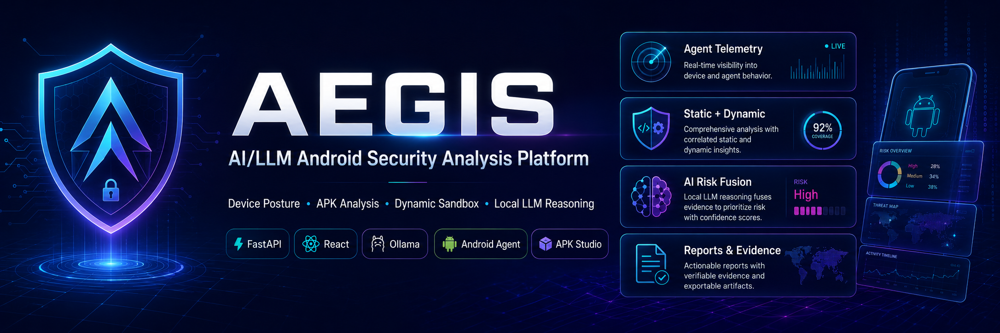

# 🛡️ AEGIS — Dark Cyber Security Platform

### ⚡ AI-powered mobile security console for APK analysis, device risk, local RAG, web search, and evaluation workflows

<br />


<br />

**AEGIS** is a defensive mobile-security platform that connects Android device telemetry, APK analysis, local AI, PDF-based security knowledge retrieval, web search, and evaluation metrics into one dark command-center experience.

</div>

---

## 📌 Table of Contents

- [🎯 Overview](#-overview)
- [🧩 Problem Statement](#-problem-statement)
- [🚀 Solution](#-solution)
- [🧠 Why AEGIS is Different](#-why-aegis-is-different)
- [✨ Core Features](#-core-features)
- [🧠 Shieldy AI Assistant](#-shieldy-ai-assistant)
- [🏗️ System Architecture](#️-system-architecture)
- [🔁 Workflow Pipelines](#-workflow-pipelines)
- [📊 Capability Chart](#-capability-chart)
- [📦 APK Studio](#-apk-studio)
- [📈 Evaluation Workflow](#-evaluation-workflow)
- [🛠️ Tech Stack](#️-tech-stack)
- [📁 Project Structure](#-project-structure)
- [⚙️ Prerequisites](#️-prerequisites)
- [🔐 Environment Configuration](#-environment-configuration)
- [▶️ How to Run](#️-how-to-run)
- [🩺 Health Checks](#-health-checks)
- [🎬 Demo Flow](#-demo-flow)
- [🧪 Useful Test Commands](#-useful-test-commands)
- [⚠️ Limitations](#️-limitations)
- [🔮 Future Work](#-future-work)
- [🏁 Final Summary](#-final-summary)

---

## 🎯 Overview

**AEGIS** is a local, Dockerized cyber-security platform focused on **Android mobile security**. It helps analysts inspect device posture, analyze APK files, explain security evidence, retrieve trusted documentation, search online sources, and evaluate detection performance.

The platform is designed as a **graduation-project MVP** with a production-style architecture and multiple integrated services.

### 🔥 What AEGIS Does

| Area | Description |
|---|---|
| 🛡️ Device Risk | Shows selected device posture, risk score, logs, payloads, and apps |
| 📦 APK Analysis | Supports APK static/dynamic analysis and report generation |
| 🤖 AI Assistant | Uses Shieldy to explain findings and recommend actions |
| 📚 Local RAG | Retrieves local PDF knowledge using Qdrant vector search |
| 🌐 Web Search | Searches online security resources when explicitly requested |
| 📊 Evaluation | Measures strict and review-based detection performance |

---

## 🧩 Problem Statement

Mobile security workflows are often fragmented. Analysts usually need separate tools for APK analysis, device telemetry, security documentation, AI explanation, and reporting.

This creates several issues:

- 🔴 Security evidence is scattered across different systems.
- 🔴 Device risk is difficult to explain clearly.
- 🔴 APK analysis results are technical and hard to convert into actions.
- 🔴 OWASP documentation is not directly connected to investigation workflows.
- 🔴 Many tools generate alerts without showing useful evidence.
- 🔴 Detection quality is hard to measure without evaluation metrics.

---

## 🚀 Solution

AEGIS combines mobile security workflows into one platform:

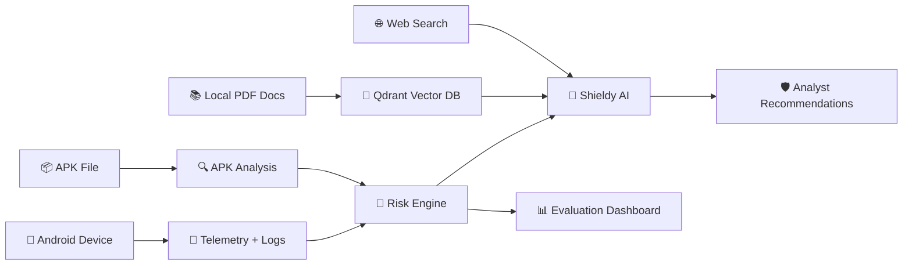

AEGIS provides a single place for:

1. Device risk monitoring.
2. APK static and dynamic analysis.
3. AI-assisted investigation.
4. Source-grounded security explanations.
5. Evaluation and review workflows.

---

## 🧠 Why AEGIS is Different

AEGIS is not only a dashboard. It correlates Android device telemetry, app inventory, security logs, payload evidence, AI findings, local PDF knowledge, and live web search into one analyst workflow.

Instead of showing isolated alerts, AEGIS explains why a device is risky, what evidence supports the decision, and what the analyst should do next.

AEGIS is different because it combines:

| Capability | Why It Matters |
|---|---|
| 📱 Device Context | Connects risk score, apps, logs, payloads, and posture signals |
| 📚 Local RAG | Answers mobile-security questions from trusted local PDF knowledge |
| 🌐 Web Search | Retrieves current online security references when explicitly requested |
| 🤖 AI Explanation | Converts raw findings into analyst-friendly next steps |
| 📊 Evaluation | Measures detection quality using strict and review-based metrics |

---

## ✨ Core Features

### 🖥️ Security Console

- Dark command-center UI.
- Selected device context.
- Risk level badges.
- Payload, apps, and logs overview.
- Pending actions section.
- Platform shortcuts for supporting tools.

### 🤖 Shieldy Chat

Shieldy supports three major knowledge routes:

| Route | Trigger Example | Output |
|---|---|---|
| 📱 Device Context | `what is recommended for current device?` | Risk summary, evidence, next steps |
| 📚 Local PDF RAG | `what is MASVS?` | PDF-grounded answer with source pages |
| 🌐 Web Search | `make a web search about mobile security` | Web-grounded answer with URLs |

### 📦 APK Studio

- APK upload.
- Static analysis.
- Dynamic analysis support.
- Job tracking.
- Evidence and reports.
- Analyst review workflow.

### 📊 Evaluation Dashboard

- Dataset manager.
- Strict Detection metrics.
- Review Detection metrics.
- Confusion matrix.
- Wrong predictions.
- Calibration dashboard.
- Risk distribution.

---

## 🧠 Shieldy AI Assistant

**Shieldy** is the AI investigation assistant inside AEGIS. It turns security data into clear explanations and recommendations.

### 🧠 Shieldy Context Sources

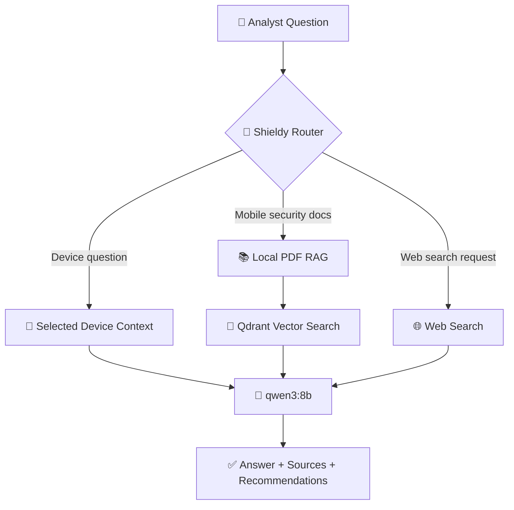

### ✅ Shieldy Modes

#### 1. Device Context Mode

Example:

```text
what is recommended for current device?
```

Shieldy returns risk summary, device name, evidence, recommendations, and telemetry/risk sources.

#### 2. Local PDF RAG Mode

Example:

```text
what is MASVS?
```

Shieldy retrieves local PDF chunks from Qdrant and returns PDF titles and page numbers.

#### 3. Web Search Mode

Example:

```text
make a web search about mobile security
```

Shieldy returns an online-source-grounded answer with web titles, snippets, and URLs.

### 🧬 AI / RAG Runtime

| Component | Value |
|---|---|
| Local LLM runtime | Ollama |
| Chat/RAG model | `qwen3:8b` |
| Embedding model | `nomic-embed-text:latest` |
| Vector DB | Qdrant |
| Local docs | PDF knowledge base |
| Main collection | `security_assistant_v2` |

---

## 🏗️ System Architecture

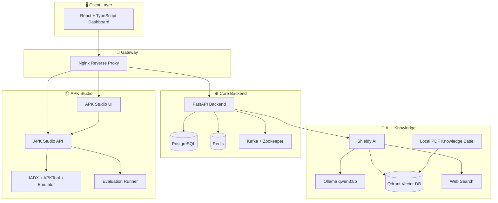

---

## 🔁 Workflow Pipelines

### 📱 Device Risk Pipeline

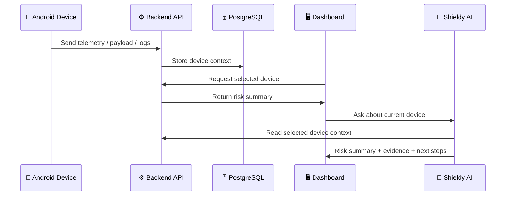

### 📚 Local PDF RAG Pipeline

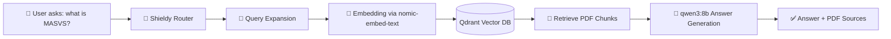

### 🌐 Web Search Pipeline

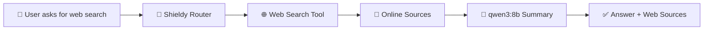

### 📦 APK Analysis Pipeline

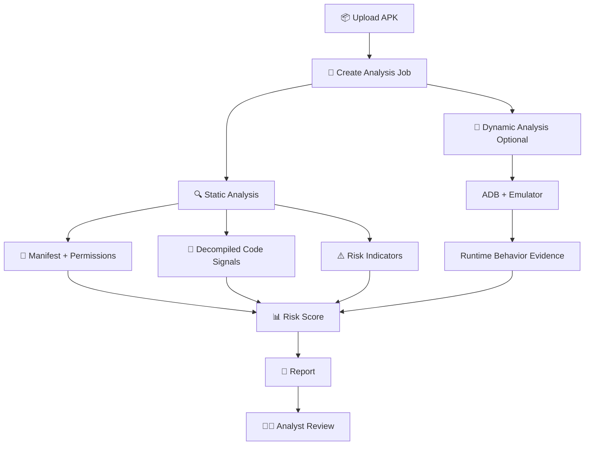

### 📊 Evaluation Pipeline

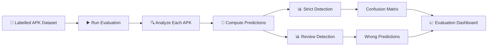

---

## 📊 Capability Chart

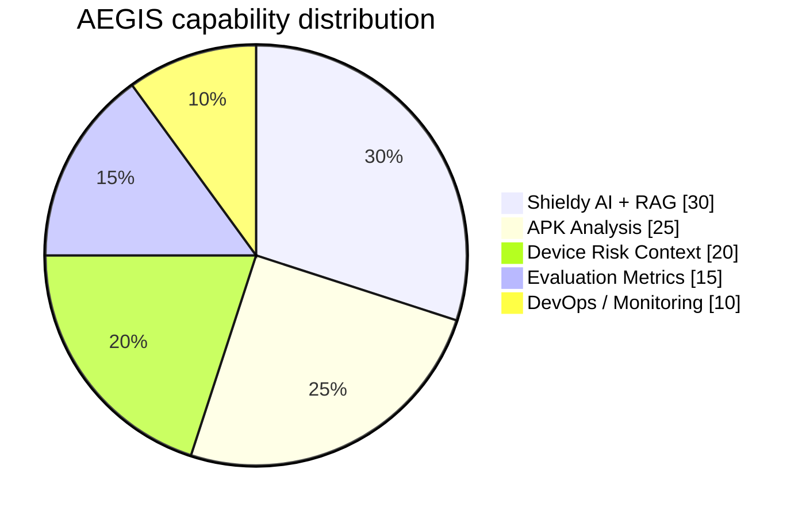

---

## 📦 APK Studio

APK Studio is responsible for APK analysis and evaluation.

| Feature | Description |
|---|---|
| 📤 APK Upload | Upload APK samples for analysis |
| 🔍 Static Analysis | Inspect manifest, permissions, code signals, and risky patterns |
| 📱 Dynamic Analysis | Run emulator-driven analysis when available |
| 📄 Reports | Generate analysis reports |
| 🧾 Review Queue | Support analyst review decisions |
| 📊 Evaluation | Run labelled dataset evaluation |

---

## 📈 Evaluation Workflow

AEGIS separates evaluation into two detection modes.

### Strict Detection

```text
High / Critical only
```

Strict Detection is conservative and represents confirmed risky applications.

### Review Detection

```text
Medium or score >= 35
```

Review Detection is triage-oriented and flags suspicious or vulnerable applications that need analyst review.

| Metric | Purpose |
|---|---|
| Accuracy | Overall correctness |
| Precision | How many flagged apps were actually risky |
| Recall | How many risky apps were detected |
| F1-score | Balance between precision and recall |
| False Positives | Benign apps incorrectly flagged |
| False Negatives | Risky apps missed |
| Confusion Matrix | Visual prediction breakdown |

---

## 🛠️ Tech Stack

### Frontend


### Backend


### AI / RAG


### Infrastructure


---

## 📁 Project Structure

```text
Graduation-Project-main/
│
├── backend/
│   ├── app/
│   │   ├── api/
│   │   ├── shieldy/
│   │   │   ├── rag.py
│   │   │   ├── web_search.py
│   │   │   └── Data/
│   │   ├── config.py
│   │   └── ...
│   ├── pyproject.toml
│   └── Dockerfile
│
├── frontend/
│   ├── src/
│   │   ├── App.tsx
│   │   ├── api.ts
│   │   ├── styles.css
│   │   └── types.ts
│   └── Dockerfile
│
├── apk-studio/
│   ├── backend/
│   ├── frontend/
│   ├── scripts/
│   └── evaluation_dataset/
│
├── docker-compose.yml
├── .env
└── README.md
```

---

## ⚙️ Prerequisites

Install:

- Docker Desktop
- Git
- Node.js
- Python
- Android Studio / Android SDK
- Ollama
- Windows PowerShell

Pull the local AI models:

```powershell
ollama pull qwen3:8b
ollama pull nomic-embed-text:latest
```

Optional models:

```powershell
ollama pull llama3:latest
ollama pull mistral:latest
```

---

## 🔐 Environment Configuration

Important `.env` values:

```env
AEGIS_LOCAL_LLM_PROVIDER=ollama
AEGIS_LOCAL_LLM_BASE_URL=http://host.docker.internal:11434
AEGIS_LOCAL_LLM_TIMEOUT_SECONDS=180

AEGIS_LOGS_MODEL=llama3:latest
AEGIS_TELEMETRY_MODEL=llama3:latest
AEGIS_RISK_MODEL=llama3:latest

AEGIS_SHIELDY_EMBEDDING_MODEL=nomic-embed-text:latest
AEGIS_SHIELDY_RAG_MODEL=qwen3:8b
AEGIS_SHIELDY_VECTOR_DB_PATH=/app/app/shieldy/Data/Vector_Database_v2
AEGIS_SHIELDY_VECTOR_COLLECTION=security_assistant_v2
AEGIS_SHIELDY_RAG_MIN_RELEVANCE=0.03
AEGIS_SHIELDY_RAG_TOP_K=5
AEGIS_SHIELDY_MAX_CONTEXT_CHARS=6000

AEGIS_SHIELDY_WEB_SEARCH_ENABLED=true
AEGIS_SHIELDY_WEB_SEARCH_MAX_RESULTS=5
AEGIS_SHIELDY_WEB_SEARCH_TIMEOUT_SECONDS=30
AEGIS_SHIELDY_QUALITY_GATE_ENABLED=false
```

> Inside Docker containers, use `http://host.docker.internal:11434` for Ollama.

---

## ▶️ How to Run

```powershell
cd "C:\Users\cc\OneDrive\Desktop\New folder\Graduation-Project-main"
```

Stop port 80 conflicts on Windows:

```powershell
Stop-Service SQLServerReportingServices -ErrorAction SilentlyContinue
Set-Service SQLServerReportingServices -StartupType Manual
```

Start services:

```powershell
docker compose up -d
```

Rebuild after code changes:

```powershell
docker compose build api dashboard apk-studio-api
docker compose up -d
```

Check services:

```powershell
docker compose ps
```

---

## 🩺 Health Checks

```powershell
$urls = @(
 "http://localhost/health",
 "http://localhost/docs",
 "http://localhost/admin",
 "http://localhost/dashboard/",
 "http://localhost/apk-studio/",
 "http://localhost/apk-api/api/health",
 "http://localhost/apk-api/api/readiness",
 "http://localhost/kafka-ui/",
 "http://localhost/redis/"
)

foreach ($u in $urls) {
  try {
    $r = Invoke-WebRequest $u -UseBasicParsing -TimeoutSec 20
    "$u -> $($r.StatusCode)"
  }
  catch {
    "$u -> ERROR: $($_.Exception.Message)"
  }
}
```

---

## 🎬 Demo Flow

Use this flow in the project presentation:

1. Open `http://localhost/dashboard/`.
2. Start from **Operations Overview** and explain fleet risk, log pressure, recent AI runs, and the latest AI decision.
3. Open **Device Investigation** and show the selected device, risk score, apps count, logs count, payload detail, and evidence.
4. Open **Logs Analyzer** and show high-severity events, regex threat matches, log filtering, source filtering, and timeline evidence.
5. Open **AI Center** and explain the AI analysis pipeline, router decision, evidence lineage, final assessment, and model runs.
6. Ask Shieldy a device-context question: `What is the current risk level of the selected device, and why?`.
7. Ask Shieldy a local RAG question: `Explain the difference between MASVS and MASTG.`.
8. Ask Shieldy another RAG question: `Why is storing tokens in SharedPreferences considered insecure?`.
9. Ask Shieldy a live web-search question: `make a web search about securing storage in Android`.
10. Ask Shieldy another web-search question: `make a web search about SQL injection prevention`.
11. Open **APK Analyzer** and show APK Studio status, API docs, capabilities, and workflow entry points.
12. Finish by summarizing how AEGIS connects telemetry, risk scoring, AI explanation, RAG knowledge, web search, and APK analysis in one workflow.

---

## 🧪 Useful Test Commands

### Test Ollama From Host

```powershell
Invoke-RestMethod "http://localhost:11434/api/tags" | ConvertTo-Json -Depth 10
```

### Test Ollama From API Container

```powershell
@'
import urllib.request

url = "http://host.docker.internal:11434/api/tags"
print(urllib.request.urlopen(url, timeout=10).read().decode()[:1000])
'@ | docker compose exec -T api python -
```

### Test Vector Retrieval

```powershell
@'
from app.config import Settings
from app.shieldy.rag import MobileSecurityRag

s = Settings()
rag = MobileSecurityRag(s)

query = "OWASP MASVS mobile application security verification standard"

print("base_url:", s.local_llm_base_url)
print("collection:", s.shieldy_vector_collection)
print("embedding:", s.shieldy_embedding_model)

chunks = rag.vector_retrieve(query)
print("vector chunks:", len(chunks))

for i, c in enumerate(chunks[:3], 1):
    print("---", i)
    print("source:", c.source)
    print("page:", c.page)
    print("score:", c.score)
    print("title:", c.document_title)
    print("text:", c.text[:250].replace("\n", " "))
'@ | docker compose exec -T api python -
```

### Test Local RAG

```powershell
$headers = @{ Authorization = "Bearer sample-token" }

$session = Invoke-RestMethod -Method Post `
  -Uri "http://localhost/api/v1/chat/sessions" `
  -Headers $headers `
  -ContentType "application/json" `
  -Body '{"title":"rag test"}'

$r = Invoke-RestMethod -Method Post `
  -Uri "http://localhost/api/v1/chat/sessions/$($session.id)/messages" `
  -Headers $headers `
  -ContentType "application/json" `
  -Body (@{ content = "what is MASVS?" } | ConvertTo-Json)

$r | ConvertTo-Json -Depth 20
```

### Test Web Search

```powershell
$headers = @{ Authorization = "Bearer sample-token" }

$session = Invoke-RestMethod -Method Post `
  -Uri "http://localhost/api/v1/chat/sessions" `
  -Headers $headers `
  -ContentType "application/json" `
  -Body '{"title":"web search test"}'

$r = Invoke-RestMethod -Method Post `
  -Uri "http://localhost/api/v1/chat/sessions/$($session.id)/messages" `
  -Headers $headers `
  -ContentType "application/json" `
  -Body (@{ content = "make a web search about mobile security" } | ConvertTo-Json)

$r | ConvertTo-Json -Depth 20
```

---

## ⚠️ Limitations

- The project is a local academic MVP.
- Web search depends on network availability.
- Local LLM speed depends on host machine resources.
- Dynamic APK analysis depends on emulator readiness.
- Evaluation dataset size is limited but structured for demonstration.
- Docker Desktop must be running correctly.
- Android dynamic analysis requires correct ADB and emulator setup.

---

## 🔮 Future Work

- Expand APK evaluation dataset.
- Add malware-family classification.
- Improve dynamic analysis automation.
- Add user roles and access control.
- Add exportable PDF/HTML reports.
- Add alerting and notification workflows.
- Add more local knowledge-base documents.
- Add AI response caching.
- Add cloud deployment support.

---

## 🏁 Final Summary

AEGIS is a complete defensive mobile-security platform that integrates:

- 📱 Device risk context
- 📦 APK analysis
- 🤖 Shieldy AI assistant
- 📚 Local PDF RAG
- 🌐 Web search
- 📊 Evaluation metrics
- 🐳 Dockerized infrastructure

Shieldy makes AEGIS explainable by turning raw security signals into clear recommendations supported by evidence, sources, and analyst-friendly next steps.

---

## 👥 Graduation Team

<div align="center">
  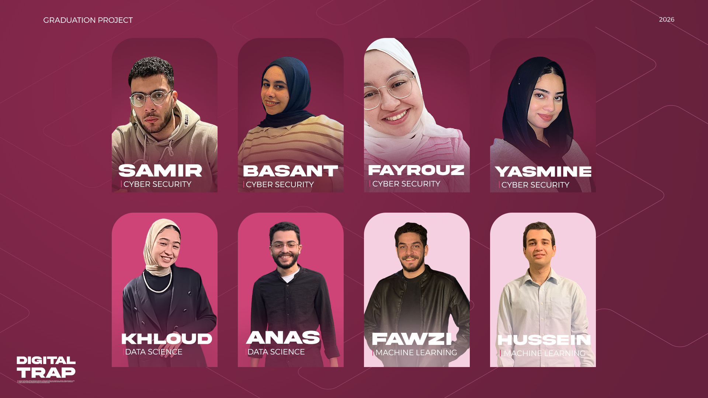
</div>

