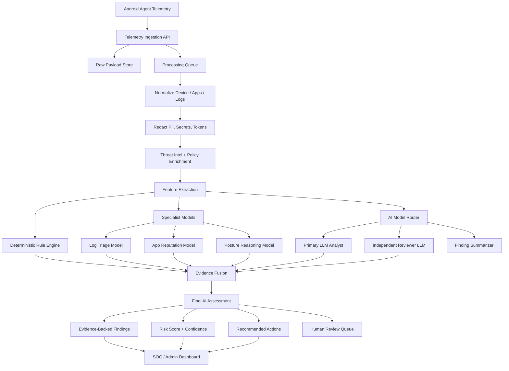
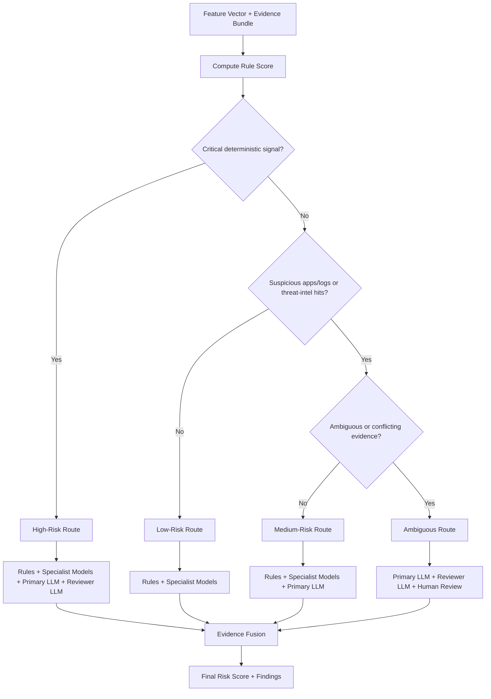
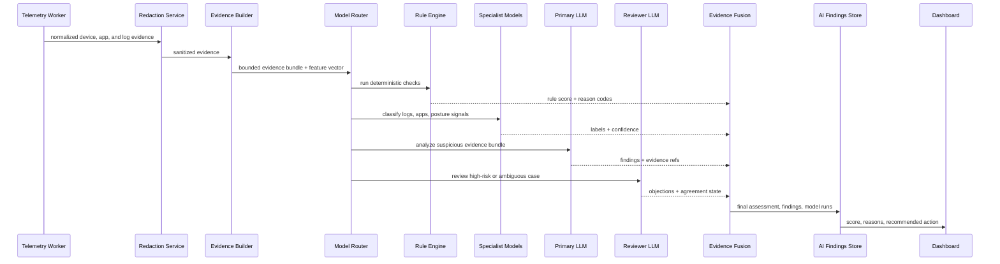
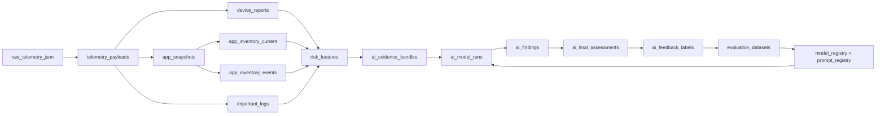
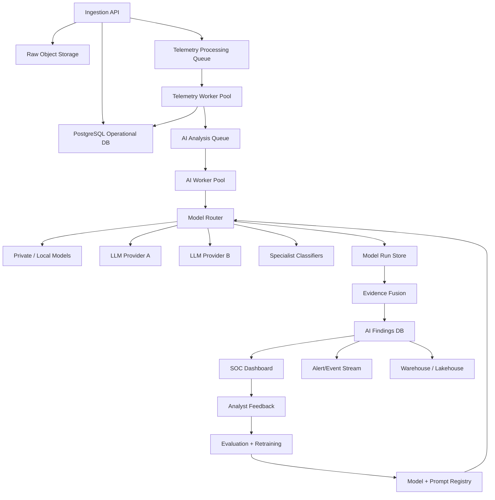
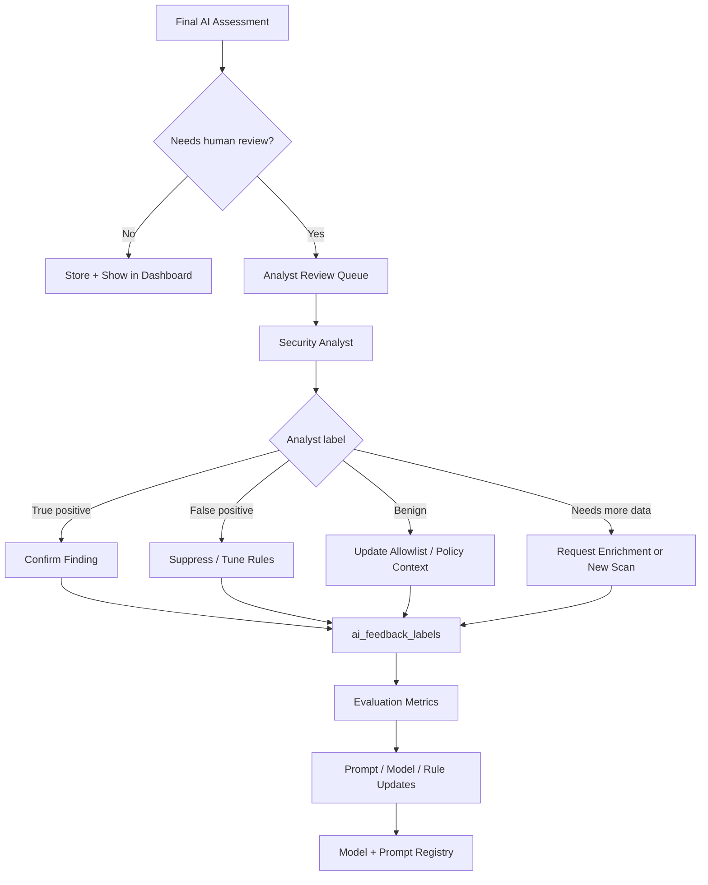

# AEGIS AI/LLM Threat Analysis Charts

These charts visualize the AI architecture for malicious app data, device
posture, and important log analysis.

Rendered artifacts:

```text
docs/ai-llm-threat-analysis-charts.pdf
docs/generated/ai-llm-charts/*.png
```

Renderer:

```text
tools/render_ai_llm_charts.py
```

## 1. AI Analysis System Overview



## 2. Model Router Decision Chart



## 3. AI Analysis Sequence



## 4. Evidence And Storage Lineage



## 5. AI Deployment Topology



## 6. Human Review Loop


