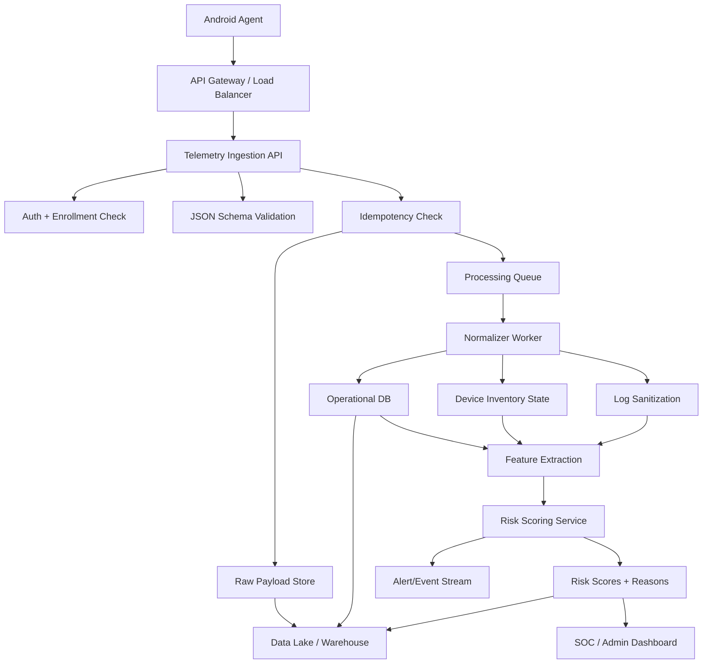
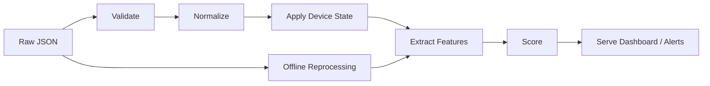
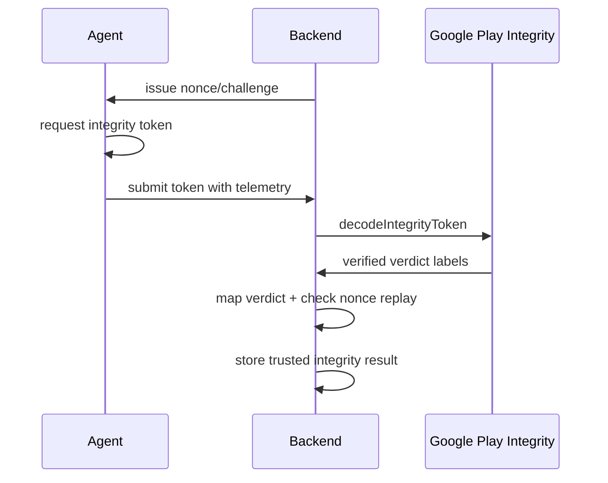
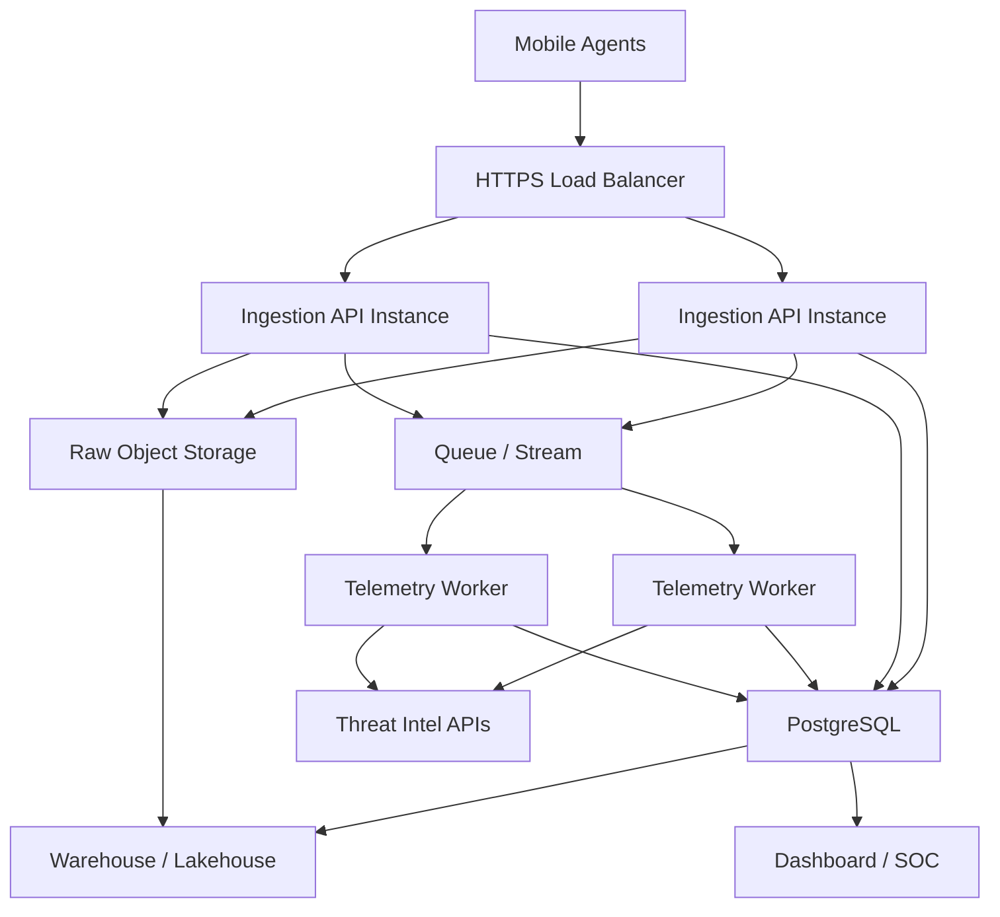

# AEGIS Backend And Data Engineering Architecture

This document defines the next-step production architecture for the AEGIS
backend and data engineering layer.

The Android agent is already able to collect telemetry, persist it locally, and
retry uploads. The current Python server is only a proof-of-concept receiver.
The backend described here is the production replacement for that POC.

## 1. What This Server Is

The backend receives telemetry from enrolled Android devices, validates and
stores the raw payload, normalizes the security domains, expands app inventory
deltas into current device state, extracts risk features, scores the device, and
emits results for dashboards, alerts, or downstream analytics.

Current agent upload contract:

```text
POST /api/v1/telemetry
```

Current schema:

```text
aegis-agent/poc-server/telemetry_schema_v1.json
```

Important contract rule:

```text
payload_id is the idempotency key.
```

If the Android agent retries a failed upload, it sends the same `payload_id`.
The backend must accept duplicates safely without double-counting inventory,
logs, features, or alerts.

## 2. High-Level Architecture



## 3. Recommended Service Boundaries

### Ingestion API

Path:

```text
backend/api/
```

Responsibilities:

- accept `POST /api/v1/telemetry`
- authenticate enrolled agents
- enforce request size limits
- validate payloads against schema v1
- enforce idempotency by `payload_id`
- persist the raw payload before deeper processing
- enqueue accepted payloads for async processing
- return `202 Accepted` quickly

This layer should avoid expensive scoring/model work. It should be thin,
strict, and reliable.

### Processing Workers

Path:

```text
backend/workers/
```

Responsibilities:

- consume queued telemetry payloads
- normalize `device_report`
- normalize `app_snapshot`
- apply full or delta app inventories to latest device state
- sanitize and normalize `important_logs`
- extract deterministic features
- call the risk scoring layer
- write score, reasons, and processing state

Workers should be replayable from raw payloads so the data team can reprocess
historical telemetry when rules or models improve.

### Domain Layer

Path:

```text
backend/domain/
```

Responsibilities:

- payload models
- validation result models
- normalized telemetry models
- risk feature models
- risk score models
- pure business rules

The domain layer should not depend on web frameworks, queues, or databases.

### Data Access Layer

Path:

```text
backend/data/
```

Responsibilities:

- database repositories
- raw object storage client
- queue producer/consumer
- threat intelligence lookup clients
- warehouse export jobs

This is where infrastructure details live.

### Risk And AI Layer

Path:

```text
backend/risk/
```

Responsibilities:

- deterministic rule scoring
- feature vector construction
- model inference wrappers
- reason generation
- score versioning

Initial implementation should start with explainable rules. ML can be added
behind the same interface once enough labeled telemetry exists.

For the mature multi-model LLM analysis design, see:

```text
ai-llm-threat-analysis-architecture.md
```

## 4. Suggested Backend Project Layout

```text
backend/
  README.md
  pyproject.toml
  app/
    main.py
    api/
      telemetry_routes.py
      health_routes.py
      error_handlers.py
    domain/
      telemetry_payload.py
      normalized.py
      risk.py
    services/
      ingestion_service.py
      processing_service.py
      inventory_service.py
      feature_service.py
      risk_service.py
      play_integrity_service.py
    data/
      db.py
      repositories/
        telemetry_repository.py
        inventory_repository.py
        risk_repository.py
      queue.py
      raw_store.py
      threat_intel.py
    workers/
      telemetry_worker.py
      warehouse_export_worker.py
    schemas/
      telemetry_schema_v1.json
    tests/
      test_ingestion_idempotency.py
      test_payload_validation.py
      test_inventory_delta.py
      test_risk_scoring.py
```

Python/FastAPI is a natural first production step because the repo already has a
Python POC server and the data/AI work will likely be Python-heavy. The
architecture does not require FastAPI specifically; the same boundaries work in
Kotlin, Go, Java, or Node.

## 5. Request Flow

### Happy Path

1. Android agent sends `POST /api/v1/telemetry`.
2. API authenticates the device/enrollment credential.
3. API validates the JSON schema.
4. API checks whether `payload_id` already exists.
5. If new, API stores the raw JSON payload.
6. API inserts a `telemetry_payloads` row with status `ACCEPTED`.
7. API enqueues a processing job.
8. API returns `202 Accepted`.
9. Worker normalizes device posture, app inventory, and logs.
10. Worker extracts features and writes a risk score.
11. Worker marks payload processing as `PROCESSED`.
12. Alerts or dashboard updates are emitted from the score.

### Duplicate Retry Path

1. Agent retries a previously accepted `payload_id`.
2. API finds the existing payload.
3. API returns a success response without re-enqueueing duplicate work.
4. Existing normalized data and score remain unchanged.

Recommended duplicate response:

```text
HTTP 202 Accepted
```

The agent only needs a successful 2xx response to mark the local upload as
complete.

### Validation Failure Path

1. API receives malformed or incomplete JSON.
2. API rejects it with `400 Bad Request`.
3. Agent keeps it queued and retries according to WorkManager behavior.
4. Backend logs enough detail for debugging but avoids storing unsafe malformed
   bodies as trusted telemetry.

## 6. Data Model

Minimum operational tables:

```text
devices
enrollments
telemetry_payloads
device_reports
app_snapshots
app_inventory_current
app_inventory_events
important_logs
risk_features
risk_scores
processing_errors
```

### `telemetry_payloads`

Purpose:

Tracks every accepted upload and owns idempotency.

Key fields:

```text
id
payload_id UNIQUE
device_id
agent_scan_id
received_at
payload_created_at
schema_version
raw_payload_uri
processing_status
processing_error
```

Recommended indexes:

```text
payload_id UNIQUE
(device_id, agent_scan_id) UNIQUE
(device_id, received_at)
processing_status
```

### `device_reports`

Purpose:

Stores one normalized device posture snapshot per payload.

Key fields:

```text
payload_id
device_id
observed_at
is_rooted
root_signal_count
su_binary_found
test_keys_found
superuser_apk_found
client_integrity_verdict
backend_integrity_verdict
integrity_error_code
integrity_token_hash_sha256
security_patch_date
security_patch_age_days
bootloader_state
```

### `app_snapshots`

Purpose:

Records each submitted app inventory snapshot or delta.

Key fields:

```text
payload_id
device_id
observed_at
total_app_count
is_delta
changed_app_count
```

### `app_inventory_current`

Purpose:

Represents the latest known app state for each device.

Key fields:

```text
device_id
package_name
version_name
version_code
apk_sha256
cert_sha256
install_source
is_system_app
first_install_time
last_update_time
first_seen_at
last_seen_at
last_payload_id
```

Recommended unique index:

```text
(device_id, package_name) UNIQUE
```

### `app_inventory_events`

Purpose:

Append-only history of app inventory changes.

Key fields:

```text
payload_id
device_id
package_name
event_type
version_code
apk_sha256
cert_sha256
install_source
observed_at
```

Event type examples:

```text
FIRST_SEEN
ADDED
UPDATED
UNCHANGED
REMOVED
```

Note: the current agent delta payload reports changed/observed apps. It does not
yet explicitly include removed app records, so removal detection may require
periodic full snapshots or future agent schema support.

### `important_logs`

Purpose:

Stores sanitized important logs attached to a scan.

Key fields:

```text
payload_id
device_id
observed_at
tag
level
matched_rule
message_redacted
message_hash
```

Raw log messages can contain sensitive text. Store raw messages only if privacy
policy allows it; otherwise redact before persistence and keep hashes for
correlation.

### `risk_features`

Purpose:

Stores deterministic features used by rules or ML models.

Key fields:

```text
payload_id
device_id
feature_version
features_json
created_at
```

### `risk_scores`

Purpose:

Stores the risk result shown to dashboards and alerts.

Key fields:

```text
payload_id
device_id
score_version
risk_score
risk_label
reasons_json
recommended_action
created_at
```

## 7. Data Engineering Pipeline



Pipeline stages:

1. **Raw ingest:** store unmodified payloads for replay.
2. **Schema validation:** reject malformed telemetry.
3. **Normalization:** convert JSON into relational rows.
4. **State application:** maintain latest device and app inventory state.
5. **Enrichment:** join with threat intel, package reputation, cert reputation,
   CVE or vulnerability feeds, and known MDM policies.
6. **Feature extraction:** generate stable feature vectors.
7. **Risk scoring:** produce score, label, reasons, and recommended action.
8. **Serving:** expose results to dashboards, APIs, alerts, and warehouse jobs.
9. **Reprocessing:** replay raw payloads when scoring logic changes.

## 8. Initial Feature Set

Device posture features:

```text
is_rooted
root_signal_count
client_integrity_verdict_category
backend_integrity_verdict_category
security_patch_age_days
bootloader_state_category
integrity_api_error_count_24h
```

App inventory features:

```text
total_app_count
changed_app_count
sideloaded_app_count
unknown_source_app_count
dangerous_permission_count
new_package_count_24h
apk_hash_threat_hits
cert_hash_threat_hits
cert_reuse_count
```

Log features:

```text
important_log_count
error_or_assert_count
threat_regex_count
security_tag_count
auth_failure_count
permission_denied_count
ssl_or_certificate_error_count
```

Temporal features:

```text
scan_count_24h
app_churn_rate_7d
risk_score_trend_7d
repeated_upload_failure_count
repeated_integrity_error_count
```

## 9. Risk Scoring Shape

Start with an explainable rule engine:

```text
RiskFeatureSet -> RiskScoringService -> RiskScore
```

Example output:

```json
{
  "risk_score": 63,
  "risk_label": "High",
  "reasons": [
    "Root indicators were detected.",
    "Play Integrity requires backend verification.",
    "Three sideloaded apps were observed."
  ],
  "recommended_action": "Review posture and app inventory before trusting this device."
}
```

Later, ML inference can be added as a second scorer:

```text
RuleScore + ModelScore + PolicyOverrides -> FinalRiskScore
```

Keep score versions explicit so historical scores remain explainable.

## 10. Security Architecture

Production backend must add:

- `Authorization: Bearer <agent token>` or mTLS agent authentication
- enrollment token rotation and revocation
- idempotency by `payload_id`
- strict request size limits
- JSON schema validation
- raw payload access controls
- log redaction before analytics use
- audit logging for operator access
- rate limits per device/enrollment
- certificate pinning support once production host/cert chain is known

Play Integrity production flow:



Current agent note:

The existing payload stores an integrity token hash, not the raw token. A future
agent/server contract update is needed for full backend verification.

## 11. API Surface

Initial production APIs:

```text
GET  /health
POST /api/v1/telemetry
GET  /api/v1/devices/{device_id}/latest-risk
GET  /api/v1/devices/{device_id}/timeline
GET  /api/v1/payloads/{payload_id}
```

Operational/admin APIs can be added later:

```text
POST /api/v1/enrollments
POST /api/v1/enrollments/{id}/rotate-token
POST /api/v1/enrollments/{id}/revoke
GET  /api/v1/alerts
```

Only `POST /api/v1/telemetry` is required for the Android agent integration.

## 12. Deployment View



First implementation can be simpler:

```text
FastAPI + PostgreSQL + local/background worker
```

Then evolve to:

```text
FastAPI + PostgreSQL + object storage + Redis/RabbitMQ/Kafka + workers + warehouse
```

## 13. Build Phases

### Phase B1 - Production Ingestion Skeleton

Deliverables:

- new `backend/` service
- `POST /api/v1/telemetry`
- schema validation
- idempotency by `payload_id`
- raw payload persistence
- tests for duplicate retry behavior

### Phase B2 - Operational Database

Deliverables:

- database migrations
- `telemetry_payloads`
- `device_reports`
- `app_snapshots`
- `important_logs`
- repository tests

### Phase B3 - Inventory State Engine

Deliverables:

- current app inventory table
- delta application logic
- append-only app inventory events
- tests for full scan, delta scan, and duplicate payload replay

### Phase B4 - Feature Extraction And Rule Scoring

Deliverables:

- feature extraction service
- first explainable risk rule set
- `risk_features`
- `risk_scores`
- device latest-risk endpoint

### Phase B5 - Data Engineering Exports

Deliverables:

- raw-to-warehouse export
- normalized table export
- model training dataset shape
- score versioning and reprocessing job

### Phase B6 - Production Security

Deliverables:

- production auth
- token rotation/revocation
- Play Integrity backend challenge/decode flow
- request signing or mTLS if selected
- privacy review and log redaction policy

## 14. Current Boundary

What exists now:

- Android agent upload queue and retry behavior
- stable payload identity
- telemetry schema v1
- Python POC receiver
- backend/data engineering handoff docs

What this architecture adds next:

- production ingestion shape
- normalized storage model
- replayable data pipeline
- feature and scoring layer
- security hardening path
- implementation phases for backend/data engineering
