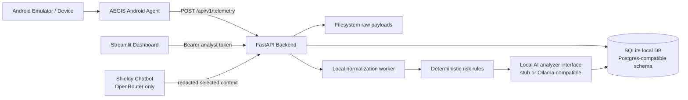
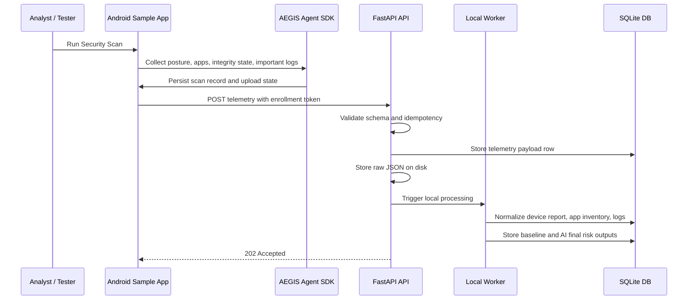
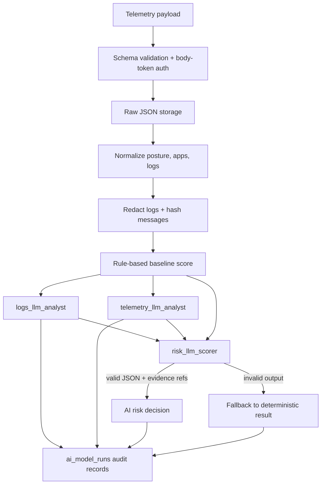
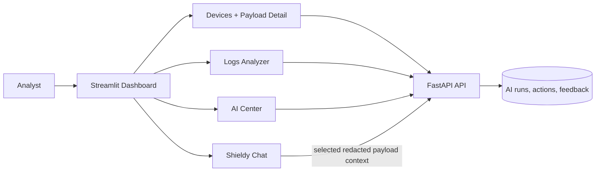
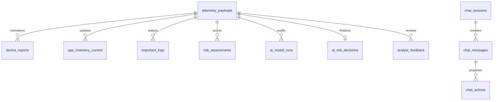

# Current Project Architecture Diagrams

This page captures the current practical MVP architecture after the backend,
logs, dashboard, and AI integration work. It is intentionally simpler than the
future production architecture.

## System Context

## Android To Backend Flow

## Backend Processing And AI Flow

## Dashboard And Analyst Flow

## Data Ownership

## Current Gaps To Keep Visible

- Local MVP uses SQLite and `create_all`; production needs verified Alembic
  migrations against Postgres.
- OpenRouter is intentionally limited to Shieldy Chat, and requires a real
  `OPENROUTER_API_KEY`.
- Local analyzers are replaceable stubs unless configured for a real local model
  runtime.
- Android log visibility depends on device policy, debug state, and OS limits;
  the backend must accept empty `important_logs`.
- Streamlit is acceptable for MVP speed, but a React/Vite dashboard becomes
  better once workflow density and role-based UX grow.
