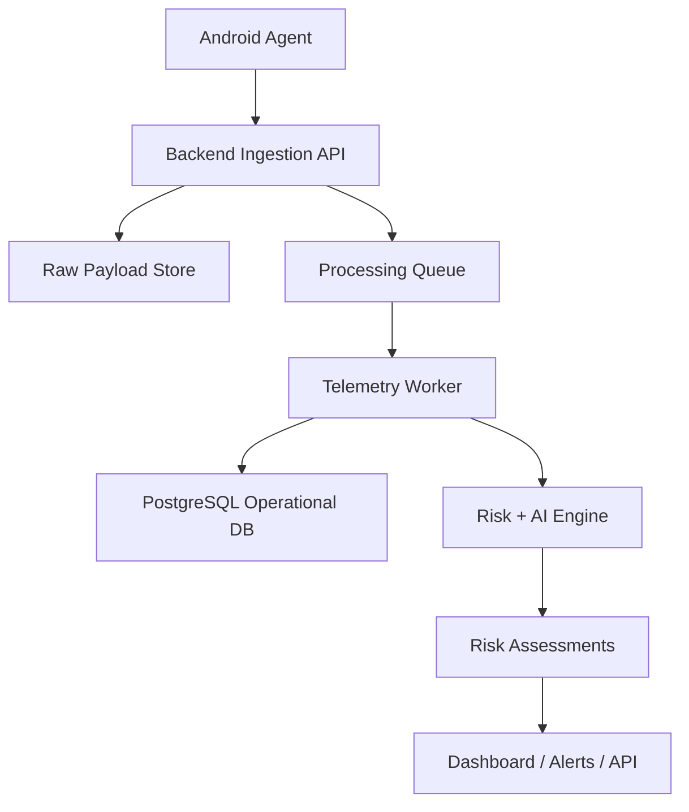
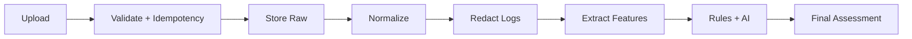
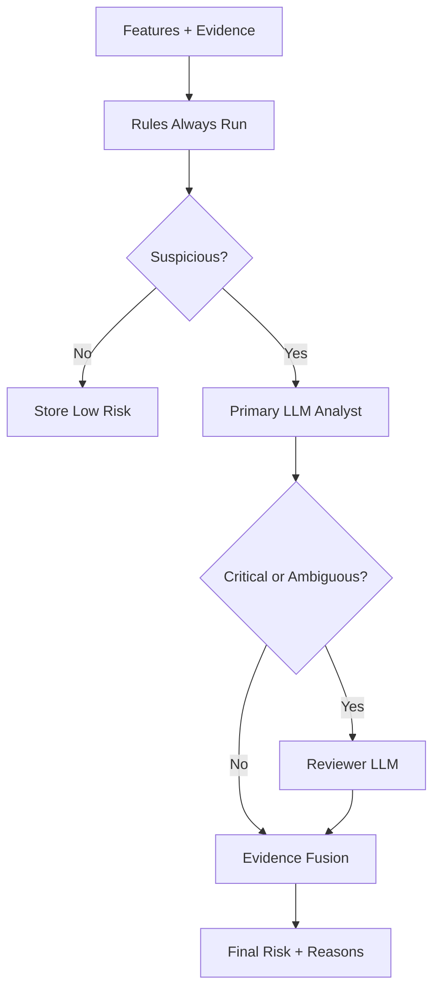
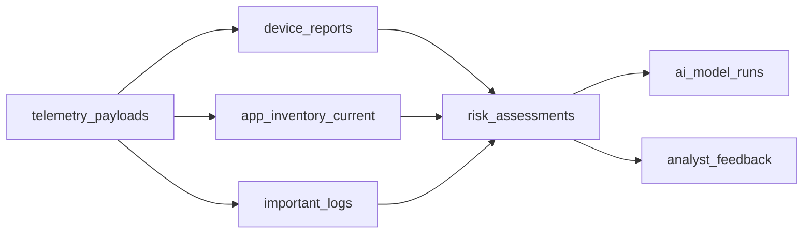

# AEGIS Final Backend Architecture Charts

Rendered artifacts:

```text
docs/final-backend-ai-architecture.pdf
docs/generated/final-backend-ai-architecture/*.png
```

Renderer:

```text
tools/render_final_backend_ai_architecture.py
```

## 1. Final Backend Overview



## 2. Processing Flow



## 3. Risk + AI Flow



## 4. Minimal Data Model



